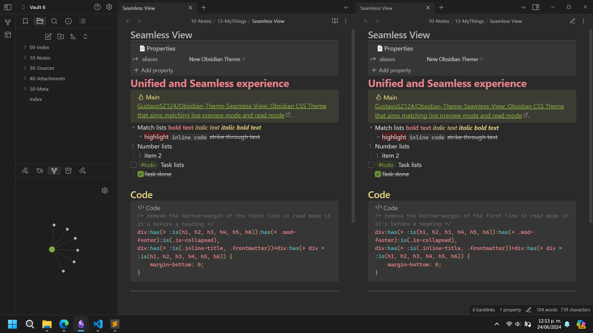

# Seamless View Theme for Obsidian

**Seamless View** is a custom CSS theme for Obsidian designed to provide a **unified and seamless experience** between the Live Preview and Read Mode, ensuring minimal visual differences when toggling between the two. This is particularly **useful for canvas elements** where cards have specific sizes, ensuring consistency in appearance when edit the content.

  

## Features

-   **Seamless Transition**: With Seamless View, you'll hardly notice the difference between reading mode and live preview mode. This allows for an uninterrupted flow of thoughts as you write and review your notes.
-   **Plugin Support**: Includes custom styles for several popular plugins, including Dataview, QuickAdd, Kanban, Tasks, and more, to ensure a cohesive look across your Obsidian setup.
-   **Customization:** While the core design promotes a seamless experience, you can still personalize various aspects of the theme to suit your preferences.

## Installation

1. Open Obsidian and go to **Settings > Appearance**.
2. Click on the **Themes** tab.
3. Click on the **Community Themes** button.
4. Search for **Seamless View** and click on the **Install** button.
5. Click on the **Use** button to activate the theme.

## Usage

Once installed, simply switch between reading mode and live preview mode to appreciate the seamless transition between the two. Customize the theme further according to your preferences by tweaking the CSS variables in the `seamless-view.css` file.

## Support

If you encounter any issues with the Seamless View theme, please feel free to create an issue on the theme's GitHub repository.

## License

This project is licensed under the MIT License. See the [LICENSE](LICENSE) file for details.

## Acknowledgements

Special thanks to the Obsidian community for their continuous support and feedback.

---

Enjoy a truly seamless experience with Seamless View in Obsidian!
